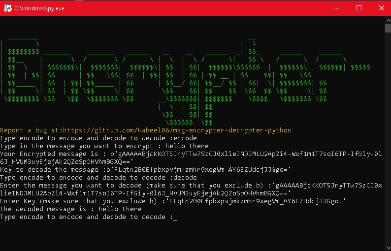

# message-encrypter-using-python
## 📝About
A program that encrypts and decrypts a message using special keys.

## 👨‍💻 Dependencies
MAKE SURE THAT YOU HAVE THESE MODULES INSTALLED FIRST!
> cryptography 
> termcolor 
> colorama 

## 📺 Updates
> Its in development.
> It has many bugs.
